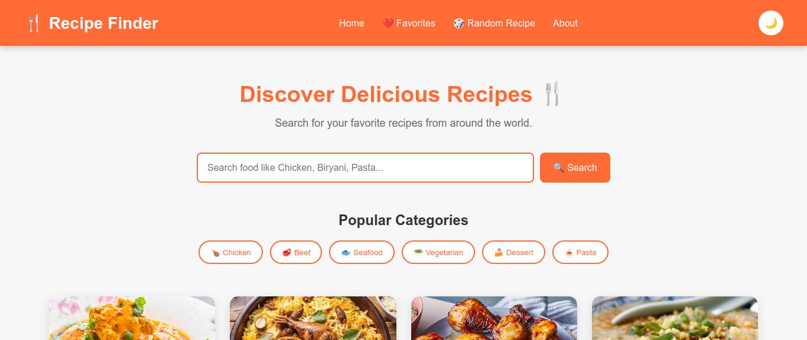
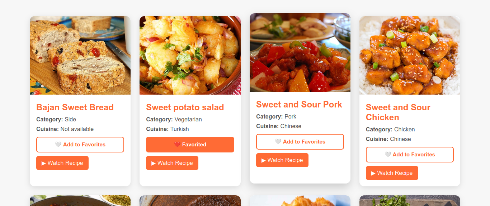
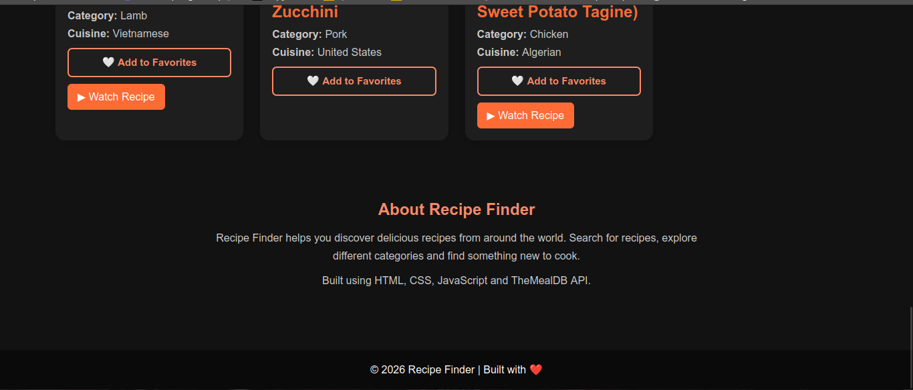

# 🍴 Recipe Finder

A responsive Recipe Finder web application that helps users discover delicious recipes from around the world.

🔗 **Live Demo:**  
https://mahathikanigiri006.github.io/Recepiefinder/

## 📸 Screenshots

### 🏠 Home Page



### 🍴 Recipe Search and Categories



### 🌙 Dark Mode



## ✨ Features

- 🔍 Search recipes by food name
- 🍗 Browse popular recipe categories
- 🎲 Get a random recipe
- ❤️ Add and remove favorite recipes
- 💾 Save favorites using LocalStorage
- 🌙 Dark mode
- ☀️ Light mode
- ⌨️ Search using the Enter key
- 🎥 Watch recipe videos on YouTube
- 📱 Responsive design for different screen sizes
- ⚡ Real-time recipe data using TheMealDB API
- ⚠️ Loading and error messages

## 🛠️ Technologies Used

- HTML5
- CSS3
- JavaScript
- TheMealDB REST API
- Fetch API
- LocalStorage
- Git
- GitHub
- GitHub Pages

## 🔌 API

This project uses the **TheMealDB API** to retrieve recipe information.

The API provides:

- Recipe names
- Recipe images
- Food categories
- Cuisine information
- YouTube recipe links
- Recipe data

## 📂 Project Structure

```text
RecipeFinder/
│
├── index.html
├── style.css
├── script.js
├── home.png
├── recipes.png
├── dark-mode.png
└── README.md
